# YouTube Downloader

I wrote this application in Python, using [pytube](https://github.com/pytube/pytube) to download YouTube videos, [custometkinter](https://github.com/TomSchimansky/CustomTkinter) as the UI library (which is based on Tkinter), and [moviepy](https://github.com/Zulko/moviepy) to attach audio to video files.

## Table of Contents 
* [Find via URL](#find-via-url)
* [Search](#search)
* [Downloads](#downloads)
* [Merging Audio and Video files](#merging-audio-and-video-files)
* [Settings](#settings)
* [Additional Features](#additional-features)

## Find via URL
Using this feature, users can paste a YouTube video URL, and when they press the Find by URL button, a tab view is displayed with the YouTube video thumbnail and details as well as the Downloads tab, where they can select what kind, resolution, format, and frame rate they wish to download. The only place where YouTube streams can be filtered and downloaded is here.

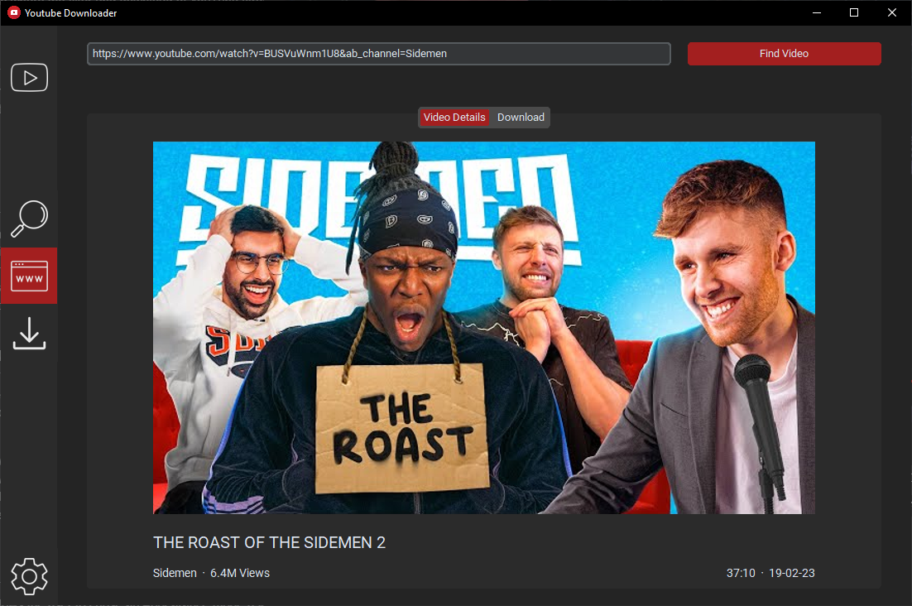
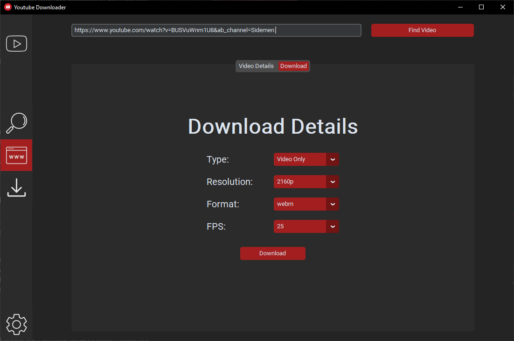
## Search 
With this feature, users can search for YouTube videos as if they were on the YouTube website. When the user presses the search button, the videos will load in a scrollable frame. Once the user selects a video, they will be taken to the URL frame with the video URL already pasted and the tab view already loading. (see [find via URL](#find-via-url)).

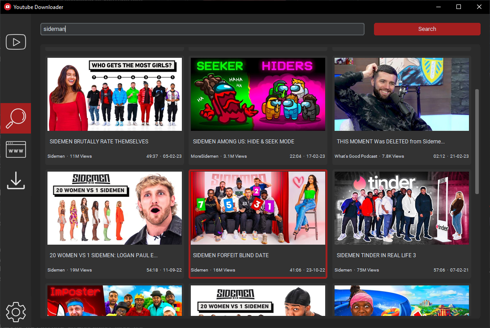
## Downloads
The Downloads frame consists of two tabs: "Completed" and "Downloading". The Downloading tab displays information about ongoing downloads, including a thumbnail, type, resolution, format, frames per second, and the percentage of the download that has been completed.

The Completed tab shows information about completed downloads, such as a thumbnail, type, resolution format, frames per second, and size. It also allows you to delete or open each completed download. The completed downloads are saved in a JSON file and are loaded from the file when the program starts.

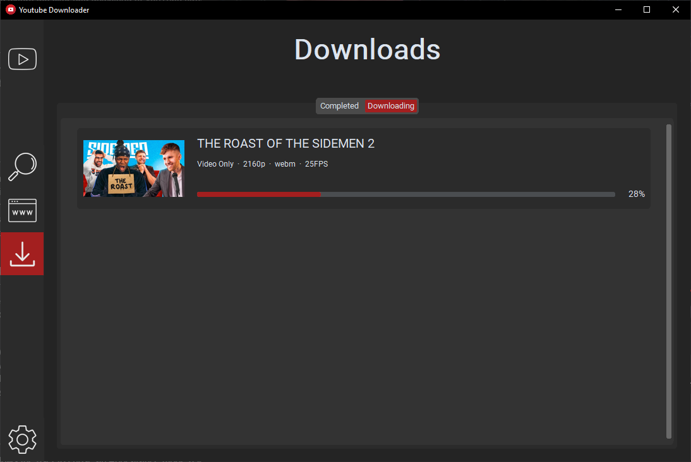
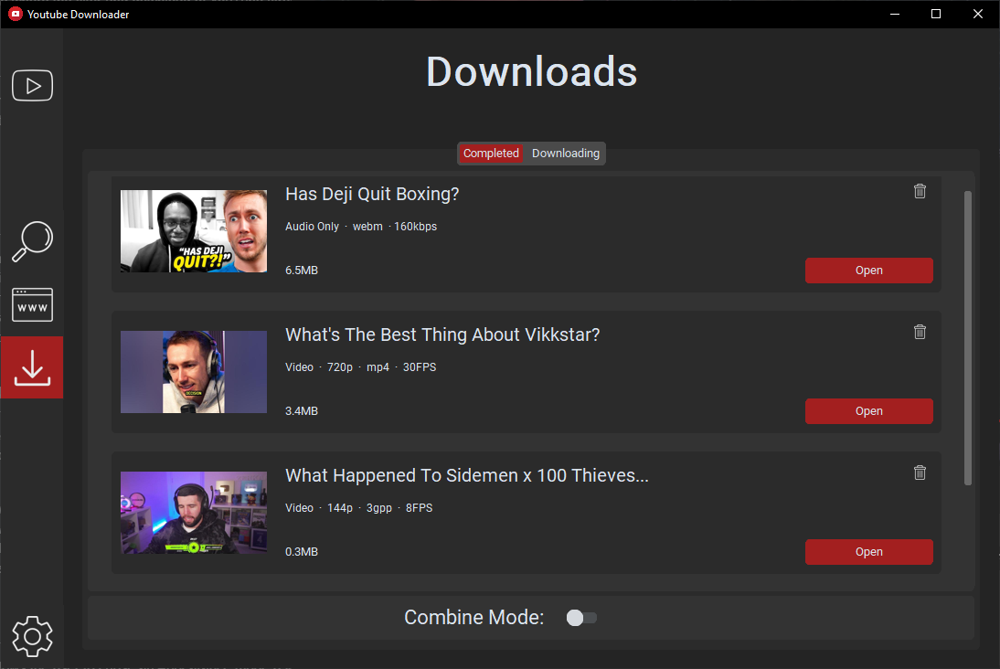

## Merging Audio and Video Files
Currently, YouTube only allows video and audio streams to be downloaded at a maximum resolution of 720p. If you want to download videos in higher resolutions, you can combine separately downloaded video and audio files into a single video file.

To do this, go to the Completed Downloads tab in the [Downloads](#downloads) frame. Turn on the Combine Mode toggle switch, which will display a checkbox next to each completed download. Check the boxes next to one Video Only and one Audio Only download of the same YouTube video, and then press combine, this will combine them into a single file using the [movipy](https://github.com/Zulko/moviepy) library. Keep in mind that this feature uses the CPU heavily, as it exports a new video file.

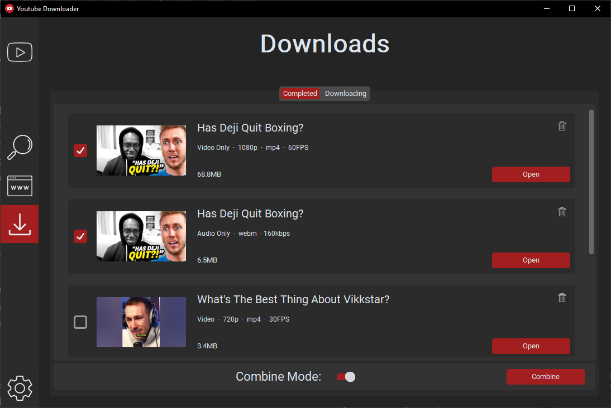
## Settings 
The Setting frame allows the user to choose an Appearance mode. The available modes are Light, Dark, and System (with Dark being the default). Additionally, the user can select a Theme color from options such as Blue, Green, Red, Purple, Yellow, and Orange (with Red being the default). Finally, the user can specify a Download location where all downloads will be saved (with the default being the User Downloads folder).

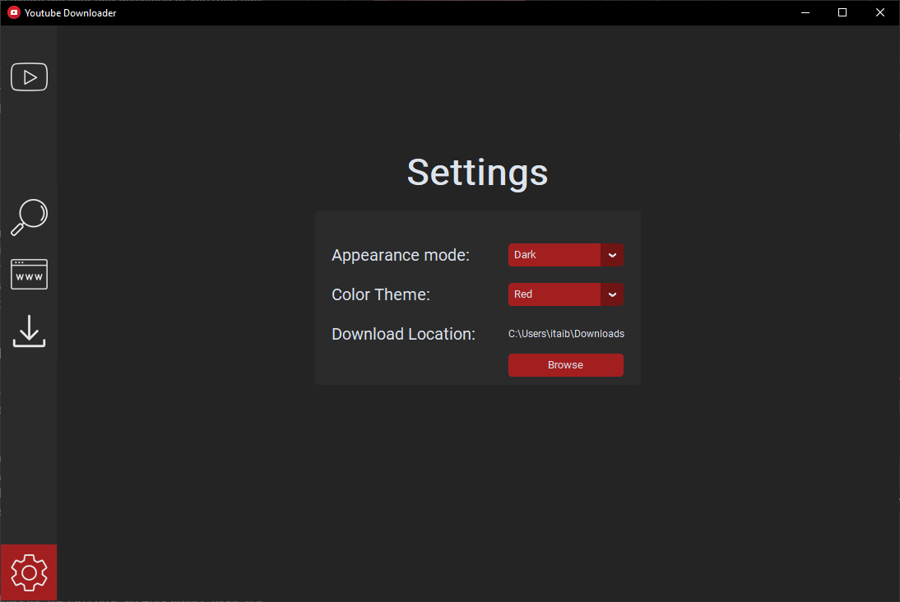
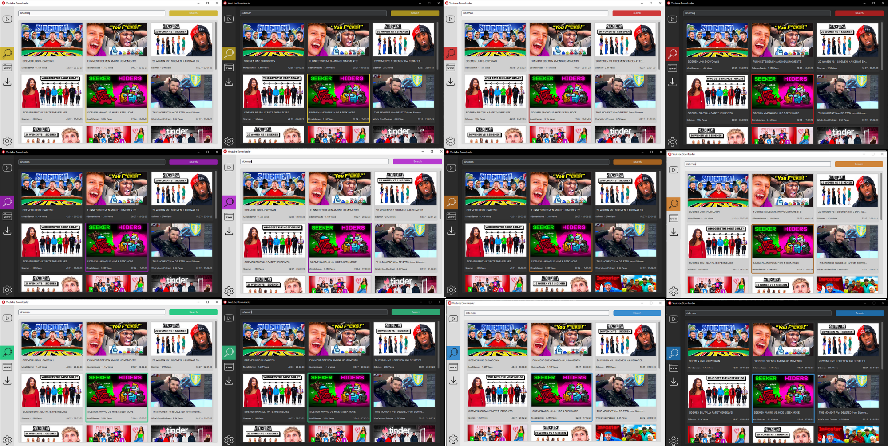

## Additional Features
The program provides helpful tips for user guidance on most elements. When the user hovers over an element with their mouse and doesn't move it for more than 0.3 seconds, a tip is displayed. This feature is available on the navigation bar, which uses icons, as well as on video titles that are too long, and most buttons.

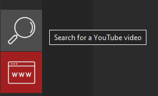

The program also utilizes Alerts and Information dialogs for when a confirmation is needed or an additional guidance is required.

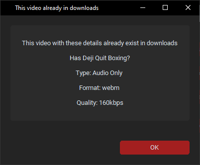
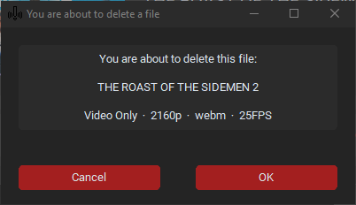

## Download and Use

This program is for personal use only. 

To Download and Use: soon
